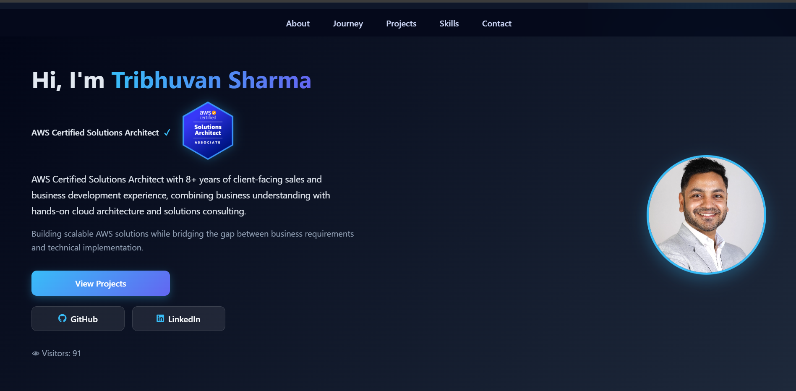

# AWS Serverless 3-Tier Portfolio Website

# Overview

This project is a fully serverless web application built on AWS. It demonstrates how modern cloud-native architectures can be used to build scalable, cost-efficient, and event-driven applications.

The application features a modern, responsive frontend combined with a serverless backend that handles real-time form submissions, visitor tracking, and email notifications.

---

# Live Demo

 https://tribhuvansharma.com/

---

# Architecture


> The visitor counter includes lightweight anti-inflation protection using browser cooldown logic, custom API request validation, and API Gateway CORS controls.

---

# Application Flow

1. User accesses the website via Amazon CloudFront (HTTPS)
2. Static frontend is served from Amazon S3
3. On page load:

   * API Gateway triggers Lambda (`GET /visits`)
   * DynamoDB updates or retrieves visitor count
4. User submits the contact form:

   * API Gateway triggers Lambda (`POST /contact`)
5. Lambda:

   * Validates input
   * Stores data in DynamoDB
   * Sends notification via SNS
6. Response is returned to frontend

---

# Tech Stack

| Service            | Purpose                |
| ------------------ | ---------------------- |
| Amazon S3          | Static website hosting |
| Amazon CloudFront  | CDN + HTTPS delivery   |
| Amazon API Gateway (HTTP API) | Serverless HTTP endpoints         |
| AWS Lambda         | Backend business logic          |
| Amazon DynamoDB    | Visitor tracking and contact storage           |
| Amazon SNS         | Email notifications    |
| Amazon CloudWatch  | Logging & monitoring   |

---

# Features

* Fully serverless architecture
* Responsive, modern UI with animations
* Contact form with validation (frontend + backend)
* Visitor counter using DynamoDB
* Event-driven email notifications via SNS
* CloudWatch logging for observability
* Clean separation of frontend and backend
* Visitor counter protected against artificial refresh inflation
* Custom header validation to reduce bot/crawler-triggered increments
* Browser cooldown logic using localStorage
* API Gateway CORS preflight handling for secure frontend-backend communication


---

# Security

* Least-privilege IAM policies
* Restricted DynamoDB access (PutItem, UpdateItem, GetItem)
* HTTPS via CloudFront
* CORS configured in API Gateway
* Input validation in Lambda
  
### Visitor Counter Protection

The visitor counter implementation includes lightweight abuse protection mechanisms:

* Browser-side cooldown logic prevents repeated refreshes from incrementing the counter
* Custom request headers restrict direct API access
* API Gateway CORS configuration controls frontend-originated requests
* Separate read-only and increment flows reduce accidental counter inflation

These protections help reduce artificial traffic from refreshes, bots, and direct API calls while keeping the architecture fully serverless.

---

# Key Learnings

* Designing serverless 3-tier architectures using AWS
* Building REST APIs using API Gateway and Lambda
* Using DynamoDB for both storage and atomic counters
* Designing lightweight visitor tracking protection using browser cooldown logic, custom request headers, and API Gateway CORS controls
* Handling JSON serialization issues (Decimal)
* Debugging CORS and API integration issues
* Implementing event-driven architecture using SNS
* Improving UI/UX for technical portfolios

---

# Challenges Faced

* API returning "Not Found" due to route configuration
* IAM permission issues affecting DynamoDB access
* SNS subscription auto-deactivation
* Lambda errors due to incorrect event handling
* Decimal serialization issues in responses
* Preventing duplicate visitor counts
* Frontend-backend integration debugging
* Browser CORS preflight (`OPTIONS`) issues after introducing custom headers
* Visitor counter inflation caused by bot/crawler traffic and multiple domain access
* Debugging CloudFront cache invalidation after frontend updates
* Handling browser localStorage behavior across root and subdomains

---

# Future Improvements

* Implement auto-reply emails using Amazon SES
* Add custom domain using Route 53
* Implement CI/CD pipeline (GitHub Actions)
* Add authentication using Amazon Cognito
* Expand project portfolio (scalable, highly available and secure architecture)
* Replace frontend cooldown logic with backend session/IP-based tracking
* Add AWS WAF for bot protection
* Implement analytics-grade visitor tracking
* Use CloudFront Functions or Lambda@Edge for request validation

---

# Project Structure

```
aws-serverless-portfolio/
│
├── frontend/
│   ├── index.html
│   ├── style.css
│
├── backend/
│   ├── lambda_function.py
│
├── architecture.png
├── Portfolio_Website_Screenshot.png
├── README.md
```

---

# Author

**Tribhuvan Sharma**  
AWS Certified Solutions Architect  
Aspiring Solutions Consultant / Pre-Sales Engineer

---

##  Portfolio Preview




