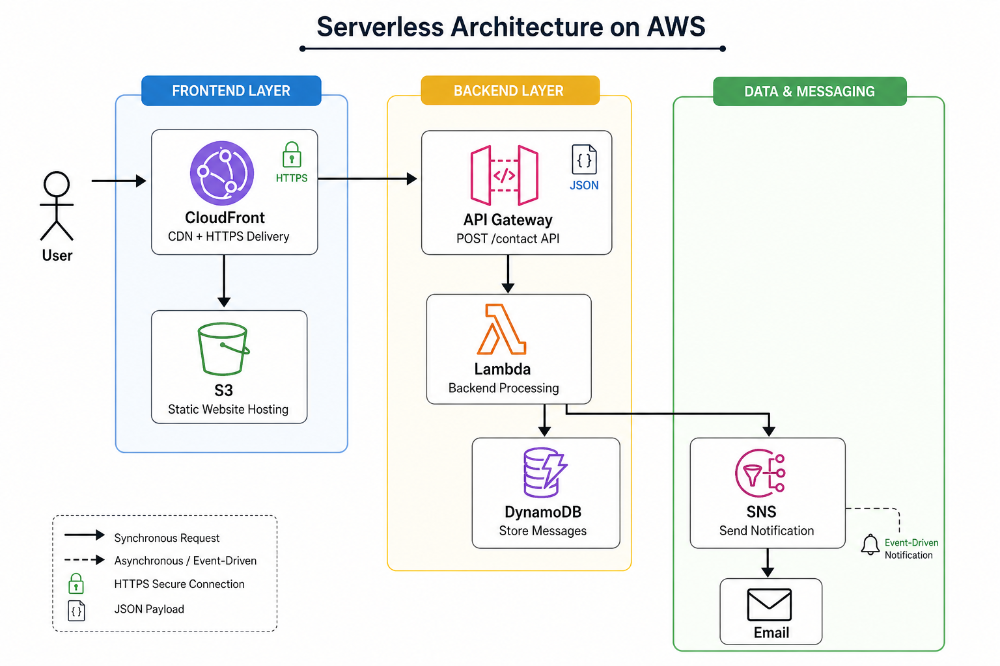

# AWS Serverless Portfolio Website

## 🚀 Overview

This project is a fully serverless web application built on AWS. It allows users to submit messages through a contact form, which are processed, stored, and trigger real-time email notifications.

The application is designed using cloud-native services and follows best practices such as event-driven architecture, least-privilege IAM, and frontend-backend separation.

---

## 🌐 Live Demo

👉 https://d2ur4gm3dnah1e.cloudfront.net/

---

## 🏗️ Architecture

### 🔄 Application Flow

1. User accesses the website via Amazon CloudFront (HTTPS)
2. Static frontend (HTML/CSS) is served from Amazon S3
3. User submits the contact form
4. Request is sent to Amazon API Gateway (`POST /contact`)
5. API Gateway triggers AWS Lambda
6. Lambda:

   * Validates input (server-side validation)
   * Stores message in DynamoDB
   * Sends notification via SNS
7. User receives confirmation (frontend), and owner receives email notification

---

## 🧰 Tech Stack

| Service            | Purpose                            |
| ------------------ | ---------------------------------- |
| Amazon S3          | Static website hosting             |
| Amazon CloudFront  | CDN + HTTPS delivery               |
| Amazon API Gateway | API endpoint for contact form      |
| AWS Lambda         | Backend logic                      |
| Amazon DynamoDB    | NoSQL database for message storage |
| Amazon SNS         | Email notifications                |
| Amazon CloudWatch  | Logging and monitoring             |

---

## ✨ Features

* Fully serverless architecture (no servers managed)
* Secure HTTPS delivery via CloudFront
* Contact form with validation (frontend + backend)
* Persistent storage using DynamoDB
* Event-driven email notifications using SNS
* CloudWatch logging for observability
* Clean separation of frontend and backend

---

## 🔐 Security

* Implemented least-privilege IAM policies for Lambda
* Restricted DynamoDB access to specific actions (`PutItem`)
* Enabled HTTPS using CloudFront
* Configured API Gateway with CORS handling
* Input validation to prevent malformed requests

---

## 🧠 Key Learnings

* Understanding differences between REST API and HTTP API in API Gateway
* Debugging CORS issues between frontend and backend
* Implementing IAM roles and least-privilege access
* Handling Lambda runtime errors and event structures
* Managing CloudFront caching and invalidation
* Understanding limitations of SNS for email delivery

---

## ⚠️ Challenges Faced

* API returning "Not Found" due to incorrect route configuration
* IAM permission issues preventing DynamoDB writes
* SNS subscription auto-deactivation behavior
* Lambda failing due to incorrect event parsing and indentation errors
* Debugging frontend-to-backend integration issues

---

## 🔮 Future Improvements

* Implement user auto-reply emails using Amazon SES
* Add custom domain using Route 53
* Implement CI/CD pipeline (GitHub Actions)
* Add authentication using Amazon Cognito
* Improve UI/UX with modern frontend framework (React)

---

## 📁 Project Structure

'''
aws-serverless-portfolio/
│
├── frontend/
│   ├── index.html
│   ├── style.css
│
├── backend/
│   ├── lambda_function.py
│
├── Portfolio Architecture.png
├── README.md

'''
---

## 🧪 How to Run (High-Level)

1. Upload frontend files to S3 and enable static hosting
2. Configure CloudFront distribution
3. Create API Gateway with POST route
4. Deploy Lambda function
5. Connect Lambda to DynamoDB and SNS
6. Update frontend to call API endpoint
7. Configure CORS and permissions

---

## 📌 Author

**Tribhuvan Sharma**
Aspiring Cloud Engineer (AWS Certified)

